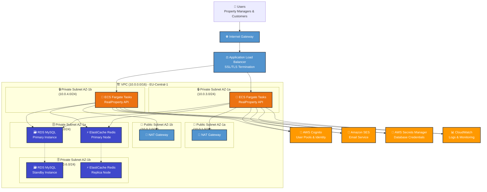
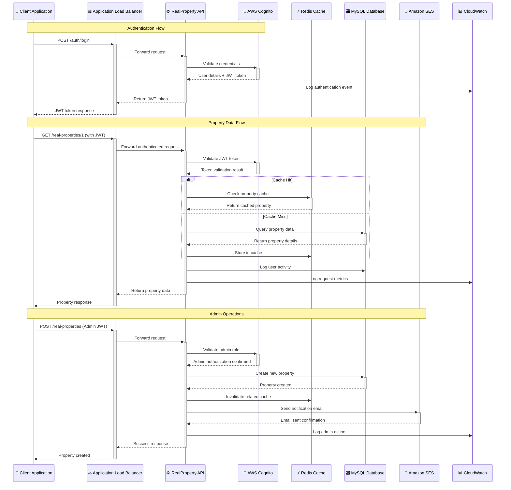

# RealProperty API - AWS Architecture Design

## Overview

This document outlines the comprehensive AWS cloud architecture for the RealProperty API application, designed for East European deployment with GDPR compliance, high availability, and scalable containerized hosting.

## Architecture Principles

- **Clean Architecture**: Maintaining separation of concerns across API, Application, Domain, and Infrastructure layers
- **Security First**: Encryption at rest and in transit, least privilege access, secure credential management
- **GDPR Compliance**: Audit logging, data retention policies, user consent management, data anonymization
- **Scalability**: Containerized deployment with auto-scaling capabilities
- **Observability**: Comprehensive monitoring and logging with CloudWatch

## High-Level System Architecture

## Application Layer Architecture

```mermaid
graph TB
    subgraph Container["🐳 ECS Fargate Container"]
        subgraph API["🌐 API Layer (CopilotDemo.Api)"]
            AuthController[🔐 AuthController<br/>JWT Token Management]
            PropController[🏠 RealPropertyController<br/>CRUD Operations]
            Middleware[🛡️ JWT Middleware<br/>Authorization]
        end
        
        subgraph Application["⚙️ Application Layer"]
            PropService[🏠 RealPropertyService<br/>Business Logic]
            AdService[📝 AdvertisementService<br/>Content Generation]
            LogService[📋 ActivityLogService<br/>Audit Trail]
        end
        
        subgraph Domain["🎯 Domain Layer"]
            RealProperty[🏠 RealProperty Entity]
            User[👤 User Entity]
            ActivityLog[📋 ActivityLog Entity]
            Events[📢 Domain Events]
        end
        
        subgraph Infrastructure["🔧 Infrastructure Layer"]
            EFContext[🗃️ EF Core DbContext<br/>MySQL Provider]
            RedisCache[⚡ Redis Cache Service]
            EmailService[📧 SES Email Service]
            CognitoAuth[🔐 Cognito Integration]
        end
    end
    
    %% External Dependencies
    MySQL[(🗃️ RDS MySQL<br/>Property Data)]
    Redis[(⚡ ElastiCache Redis<br/>Session & Cache)]
    CognitoPool[🔐 Cognito User Pool<br/>Authentication]
    SESService[📧 Amazon SES<br/>Notifications]
    
    %% Connections
    AuthController --> Middleware
    PropController --> Middleware
    PropController --> PropService
    PropController --> AdService
    PropController --> LogService
    
    PropService --> RealProperty
    AdService --> RealProperty
    LogService --> ActivityLog
    
    PropService --> EFContext
    AdService --> RedisCache
    LogService --> EFContext
    AuthController --> CognitoAuth
    PropController --> EmailService
    
    EFContext --> MySQL
    RedisCache --> Redis
    CognitoAuth --> CognitoPool
    EmailService --> SESService
    
    %% Styling
    classDef api fill:#E8F5E8,stroke:#4CAF50,stroke-width:2px
    classDef application fill:#E3F2FD,stroke:#2196F3,stroke-width:2px
    classDef domain fill:#FFF3E0,stroke:#FF9800,stroke-width:2px
    classDef infrastructure fill:#F3E5F5,stroke:#9C27B0,stroke-width:2px
    classDef external fill:#FFEBEE,stroke:#F44336,stroke-width:2px
    
    class AuthController,PropController,Middleware api
    class PropService,AdService,LogService application
    class RealProperty,User,ActivityLog,Events domain
    class EFContext,RedisCache,EmailService,CognitoAuth infrastructure
    class MySQL,Redis,CognitoPool,SESService external
```

## Data Flow Architecture

## Security & GDPR Compliance Architecture

```mermaid
graph TB
    subgraph Security["🛡️ Security & Compliance Framework"]
        
        subgraph DataProtection["🔐 Data Protection"]
            Encryption[🔒 Encryption at Rest<br/>RDS & ElastiCache KMS]
            TLS[🔐 TLS 1.3 Encryption<br/>In Transit via ALB]
            Secrets[🔑 AWS Secrets Manager<br/>Database Credentials]
        end
        
        subgraph AccessControl["👤 Access Control"]
            IAM[🎯 IAM Roles<br/>Least Privilege Access]
            Cognito[🔐 AWS Cognito<br/>User Authentication]
            JWT[🎫 JWT Tokens<br/>Stateless Authorization]
        end
        
        subgraph NetworkSecurity["🌐 Network Security"]
            VPC[🏗️ VPC Isolation<br/>Private Subnets]
            SecurityGroups[🛡️ Security Groups<br/>Port-based Access]
            NACLs[🚧 Network ACLs<br/>Subnet-level Security]
        end
        
        subgraph GDPRCompliance["⚖️ GDPR Compliance"]
            AuditLogs[📋 Audit Logging<br/>All Data Access]
            DataRetention[🗓️ Data Retention<br/>Automated Policies]
            UserConsent[✅ User Consent<br/>Cognito Custom Attributes]
            DataAnonymization[🎭 Data Anonymization<br/>User Data Removal]
        end
        
        subgraph Monitoring["📊 Security Monitoring"]
            CloudTrail[🔍 AWS CloudTrail<br/>API Call Logging]
            CloudWatch[📈 CloudWatch<br/>Security Metrics]
            Alarms[🚨 CloudWatch Alarms<br/>Security Events]
        end
    end
    
    %% Data Subjects Rights
    subgraph DataSubjectRights["👤 Data Subject Rights"]
        DataPortability[📦 Data Portability<br/>Export User Data]
        RightToErasure[🗑️ Right to Erasure<br/>Delete User Data]
        DataAccess[👁️ Data Access<br/>View Personal Data]
        DataRectification[✏️ Data Rectification<br/>Update Personal Data]
    end
    
    %% Connections
    Encryption -.-> VPC
    TLS -.-> SecurityGroups
    IAM -.-> JWT
    AuditLogs -.-> CloudTrail
    DataRetention -.-> CloudWatch
    UserConsent -.-> Cognito
    
    %% GDPR Rights Implementation
    DataPortability -.-> AuditLogs
    RightToErasure -.-> DataAnonymization
    DataAccess -.-> AuditLogs
    DataRectification -.-> AuditLogs
    
    %% Styling
    classDef security fill:#FFCDD2,stroke:#D32F2F,stroke-width:2px
    classDef gdpr fill:#E8F5E8,stroke:#388E3C,stroke-width:2px
    classDef monitoring fill:#E3F2FD,stroke:#1976D2,stroke-width:2px
    classDef rights fill:#FFF3E0,stroke:#F57C00,stroke-width:2px
    
    class DataProtection,AccessControl,NetworkSecurity security
    class GDPRCompliance gdpr
    class Monitoring monitoring
    class DataSubjectRights rights
```

## Infrastructure Components

### 1. Compute Layer
- **ECS Fargate**: Serverless container hosting
  - Auto-scaling based on CPU/memory utilization
  - Blue/green deployments for zero downtime
  - Container health checks and automatic recovery

### 2. Database Layer
- **Amazon RDS MySQL**: 
  - Multi-AZ deployment for high availability
  - Automated backups with 7-day retention
  - Encryption at rest using KMS
  - Performance Insights for monitoring

### 3. Caching Layer
- **Amazon ElastiCache (Redis)**:
  - Session storage and application caching
  - Multi-AZ with automatic failover
  - Encryption in transit and at rest

### 4. Authentication & Authorization
- **AWS Cognito User Pools**:
  - User registration and authentication
  - JWT token management
  - Custom attributes for GDPR consent
  - MFA support

### 5. Notification Services
- **Amazon SES**:
  - Transactional emails for property updates
  - GDPR-compliant email templates
  - Bounce and complaint handling

## GDPR Compliance Features

### Data Protection Measures
1. **Encryption**: All data encrypted at rest and in transit
2. **Access Controls**: Role-based access with audit trails
3. **Data Minimization**: Only collect necessary property data
4. **Retention Policies**: Automated data deletion after defined periods

### Data Subject Rights Implementation
1. **Right to Access**: API endpoints to retrieve user data
2. **Right to Rectification**: Update mechanisms for personal data
3. **Right to Erasure**: Data anonymization and deletion processes
4. **Data Portability**: Export functionality for user data

### Audit and Compliance
1. **Activity Logging**: All data access logged with user identity
2. **Consent Management**: User consent tracked in Cognito
3. **Data Processing Records**: Comprehensive logging in CloudWatch
4. **Breach Detection**: Automated monitoring and alerting

## Monitoring and Observability

### CloudWatch Integration
- **Application Metrics**: API response times, error rates, throughput
- **Infrastructure Metrics**: CPU, memory, network utilization
- **Custom Metrics**: Business KPIs and user activity patterns

### Logging Strategy
- **Structured Logging**: JSON format for better searchability
- **Centralized Logs**: All application and infrastructure logs in CloudWatch
- **Log Retention**: Configurable retention periods for compliance

### Alerting
- **Performance Alerts**: High latency, error rates
- **Security Alerts**: Failed authentication attempts, suspicious activity
- **Infrastructure Alerts**: Resource utilization, health checks

## Deployment Strategy

### CI/CD Pipeline
1. **Source Control**: GitHub integration
2. **Build Process**: Docker image creation
3. **Testing**: Automated unit and integration tests
4. **Deployment**: Blue/green deployment to ECS

### Environment Management
- **Development**: Single AZ deployment with smaller instances
- **Staging**: Production-like environment for testing
- **Production**: Multi-AZ deployment with auto-scaling

## Cost Optimization

### Resource Optimization
- **Fargate Spot**: Use Spot pricing for non-critical workloads
- **RDS Reserved Instances**: Cost savings for predictable workloads
- **ElastiCache Reserved Nodes**: Reserved pricing for stable cache usage

### Monitoring Costs
- **Cost Explorer**: Regular cost analysis and optimization
- **Budgets**: Automated alerts for cost thresholds
- **Right-sizing**: Regular review of instance sizes

## Disaster Recovery

### Backup Strategy
- **RDS Automated Backups**: Point-in-time recovery capability
- **Cross-AZ Replication**: Data redundancy across availability zones
- **Configuration Backups**: Infrastructure as Code in version control

### Recovery Procedures
- **RTO Target**: 30 minutes for critical systems
- **RPO Target**: 1 hour maximum data loss
- **Failover Process**: Automated failover for database and cache

## Future Enhancements

### Scalability Improvements
- **Multi-Region Deployment**: Expansion to other European regions
- **CDN Integration**: CloudFront for static content delivery
- **Search Enhancement**: OpenSearch for advanced property search

### Additional Services
- **API Gateway**: Rate limiting and API management
- **WAF**: Web Application Firewall for enhanced security
- **Inspector**: Automated security assessments

This architecture provides a robust, secure, and GDPR-compliant foundation for the RealProperty API, with room for future growth and enhancement while maintaining cost efficiency and operational excellence.
